# Readmigo · AI Tech Review

> Your curated AI technology news and review platform — powered by Next.js, delivering the latest insights across LLMs, agents, robotics, and more.

[](https://ai-gold-iota.vercel.app)
[](https://nextjs.org/)
[](https://react.dev/)
[](https://www.typescriptlang.org/)
[](https://tailwindcss.com/)
[](https://pnpm.io/)

**[Live Demo →](https://ai-gold-iota.vercel.app)**

---

## Features

- **Hero Article Spotlight** — Featured article with gradient hero section
- **Category Browsing** — Explore articles across 9 AI topic categories
- **Curated Topic Pages** — Deep-dive collections (e.g., OpenClaw / ClawBot with 18 articles)
- **Full-Text Search** — Find articles by keyword
- **Multi-Language Support** — English, Japanese, Chinese locale switcher
- **Dark Mode** — System-aware dark/light theme
- **Responsive Design** — Mobile-first layout with collapsible navigation
- **ISR Caching** — 60-second incremental static regeneration for fresh content
- **Infinite Scroll** — Load more articles on demand

---

## Tech Stack

| Layer | Technology | Version |
|-------|-----------|---------|
| Framework | Next.js (App Router) | 16 |
| UI Library | React | 19 |
| Language | TypeScript | 5 |
| Styling | Tailwind CSS | 4 |
| Markdown | marked | 17 |
| Font | Inter (Google Fonts) | — |
| Package Manager | pnpm | latest |
| Deployment | Vercel | — |
| Testing | Playwright | latest |

---

## Architecture

```mermaid
graph TB
    subgraph Client["Browser"]
        Header["Header + Locale Switcher"]
        Pages["Pages"]
        Footer["Footer"]
    end

    subgraph Pages["App Router Pages"]
        Home["/  Home + Hero"]
        Explore["/explore  Categories"]
        Category["/category/[slug]"]
        Article["/article/[slug]"]
        Search["/search"]
        Topics["/topics/openclaw"]
    end

    subgraph Lib["Lib Layer"]
        API["api.ts — REST Client"]
        Icons["categoryIcons.ts"]
        Data["openclaw-articles.ts"]
    end

    subgraph External["External"]
        Backend["Readmigo API\napi.readmigo.app"]
    end

    Pages --> Lib
    API -->|fetch + ISR 60s| Backend
    Topics --> Data
```



---

## Routes

| Route | Description |
|-------|------------|
| `/` | Homepage with hero article + latest articles grid |
| `/explore` | Browse all categories + featured topic pages |
| `/category/[slug]` | Articles filtered by category |
| `/article/[slug]` | Full article with Markdown rendering |
| `/search` | Keyword search across all articles |
| `/topics/openclaw` | Curated OpenClaw / ClawBot topic page |

---

## Categories

| Icon | Category | Slug |
|------|----------|------|
| 🧠 | LLMs | `llms` |
| 🔬 | Research | `research` |
| 🎨 | Multimodal | `multimodal` |
| 🤖 | Agents | `agents` |
| 💻 | Coding | `coding` |
| 🦾 | Robotics | `robotics` |
| ⚡ | Infrastructure | `infra` |
| 🏢 | Industry | `industry` |
| ⚖️ | Ethics | `ethics` |

---

## Getting Started

**Prerequisites:** Node.js 20+, pnpm

```bash
# Clone
git clone https://github.com/readmigo/ai.git
cd ai

# Install dependencies
pnpm install

# Configure environment
cp .env.example .env.local

# Start dev server (port 3003)
pnpm dev
```

### Environment Variables

| Variable | Description | Default |
|----------|------------|---------|
| `NEXT_PUBLIC_API_URL` | Backend API base URL | `https://api.readmigo.app` |

---

## Deployment

This project auto-deploys to **Vercel** on push to `main`.

[](https://vercel.com/new/clone?repository-url=https://github.com/readmigo/ai)

---

## Scripts

| Command | Description |
|---------|------------|
| `pnpm dev` | Start dev server on port 3003 |
| `pnpm build` | Production build |
| `pnpm start` | Start production server |
| `pnpm lint` | Run ESLint |
| `pnpm type-check` | TypeScript type checking |

---

## License

&copy; 2025-2026 Readmigo. All rights reserved.
